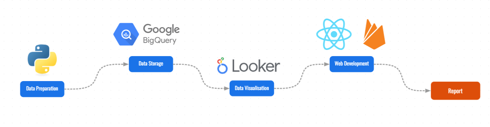

# NABxMDSS Datathon 2023

National waste management is a critical issue that demands attention, and Data Science can play a pivotal role in addressing this challenge. Waste generation and mismanagement have far-reaching environmental, economic, and social implications.

This datathon competition is an opportunity to harness the power of data analysis and prediction to tackle the issue of national waste effectively.

# Data Journey

# Check it out! 👉 [early-bird.dev/datathon2023](https://early-bird.dev/datathon2023)
